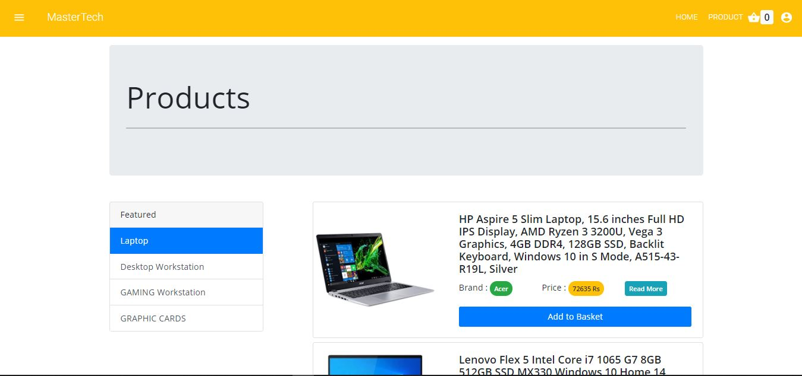
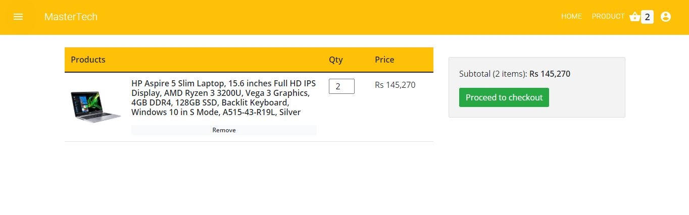

# Online-multi-vendor-E-commerce-platform
Simple E-Commerce platform which is based on the microservices architecture And developed by using Spring Boot and ReactJS

 ## About
 ---

- Signup / login 
- Authentication with JWT 
- Customers can search for the product according to the specified category.
- Customers can add and delete products from the shopping cart.
- Customers can order the products in the shopping cart.
- Customers can cancel orders
- sellers can add product.
- sellers can search and modify a product
- sellers can view orders of all users.
- sellers can change status of orders.
- Have rich text editor.
- always check authorizations of users when they accessing a private route.
- validate sign up and login pages.
- Error Handling for REST with Spring

## Used Technologies
---

- Microservice
- REST API
- Back-end: Spring Boot, JPA / Hibernate, MYSQL, validation, spring security,jwt
- Front-end: React.js, context api, material ui,react-router-dom , React Hook Form , alertifyjs , axios , draft-js , react-currency-format , sweetalert2 yup , react-spinners

## Screenshots

Product page |  Product Details Page
:------------------------:|:-------------------------:  
  |  

Cart  |  Shipping Details 
:------------------------:|:-------------------------:  
  |    

Confirm Order  |  Purchase Successful
:------------------------:|:-------------------------:
  |  

Add perfume page  |  Edit perfume page
:------------------------:|:-------------------------:
  |  

